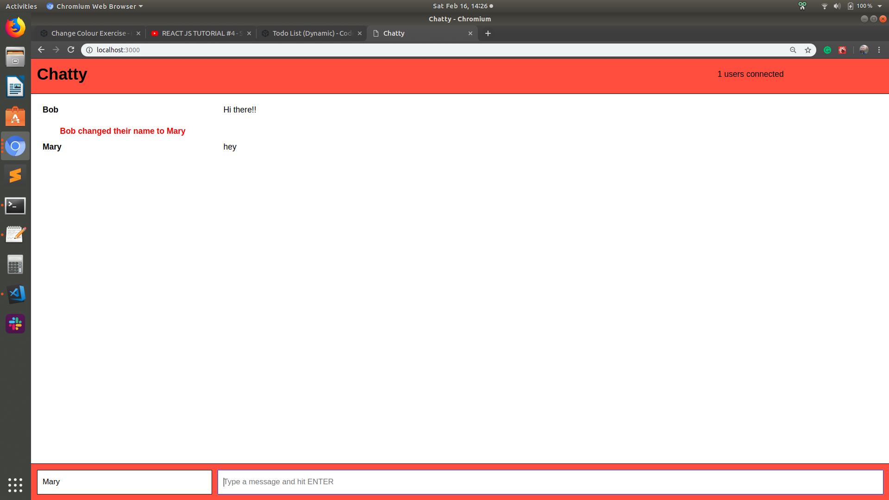
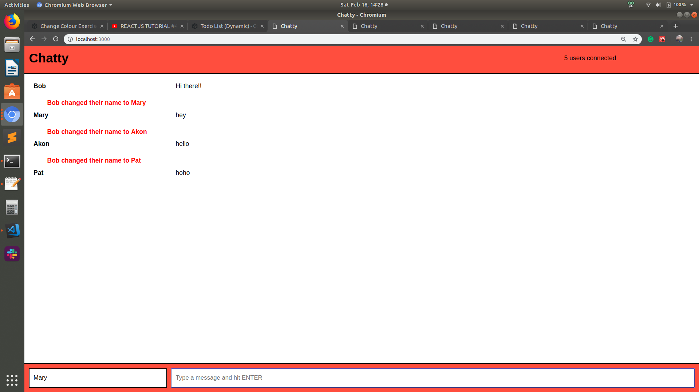

# Chatty Application
=====================

It is a application which allows users exchange messages.
A minimal and light dev environment for ReactJS.

### Getting started

1. Fork this repository, then clone your fork of this repository.
2. Install dependencies using the `npm install` command.
3. Start the web server using the `npm start` command.
4. In a new terminal, same directory, `cd chatty_server` to get inside into the message server
5. Install the WebSocket package: `npm install --save --save-exact ws`
6. Go to <http://localhost:3000/> in your browser.

Two server need to be running: the App server, ChattApp directory, and message server, chatty_server

## Images

* **System running**

  

* **Multiple users**

  

## Improvements
- Color for usernames
- Deal with Domain-Specif Language, accepting commands
- Allow the user send pictures

### Dependencies

* React
* Webpack
* [babel-loader](https://github.com/babel/babel-loader)
* [webpack-dev-server](https://github.com/webpack/webpack-dev-server)
* React-dom
* uuid
* Express
* WS